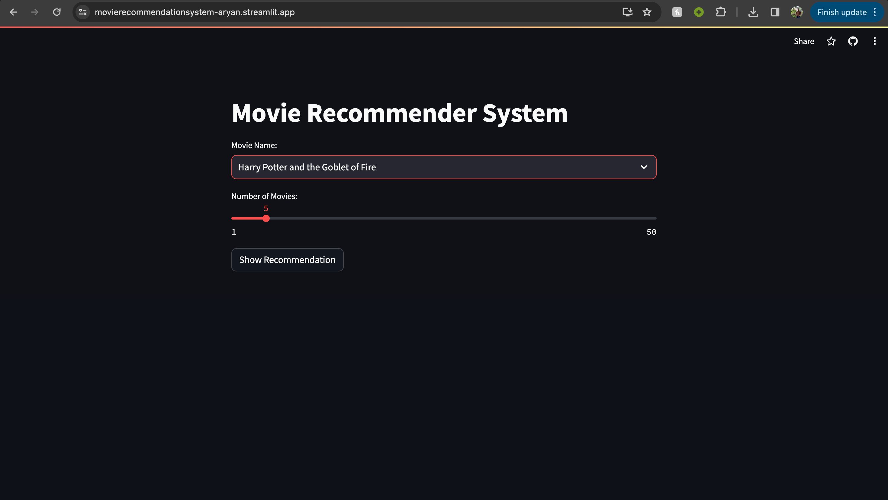
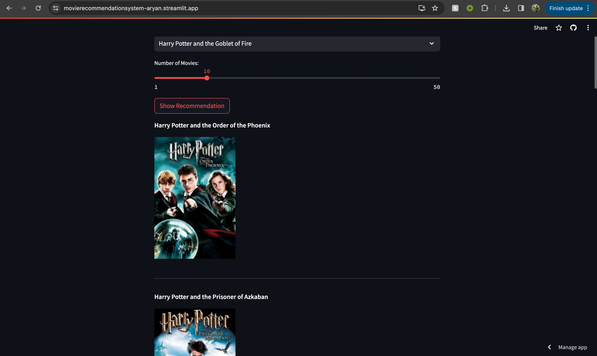

### MOVIE-RECOMMENDATION-SYSTEM
  * Content-Based Recommnedation System
  * Provide the top (1-50) related movies along with movie posters for an enhanced user experience
  * Cosine similarity function is used to recommend the top movies
  * Count Vectorizer function is used to prepare the data for vector representation
#### LINK -->
  - https://movierecommendationsystem-aryan.streamlit.app/
#### PROJECT SCREENSHOTS -->

